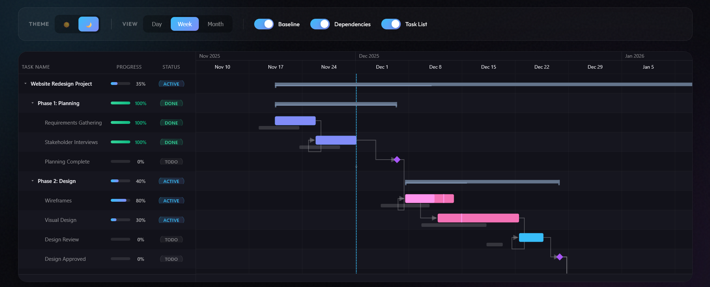

# React Gantt Next Level Chart

A lightweight, zero-dependency React Gantt chart with **native baseline support**.



## Why This Exists

I spent way too much time searching for a React Gantt chart that properly supports baselines. You know, that gray bar showing the *original* plan vs where things actually are now? Every library I found either didn't have it, or treated it as an afterthought with hacky overlays.

So I built this one. Baselines are first-class citizens here.

## Demo

Check out the [live demo](https://yi00it.github.io/react-gantt-nl/) to see it in action!

## Features

- **Native Baseline Support** - Finally! Compare planned vs actual schedules
- **Drag & Resize** - Move tasks around, resize them, update progress
- **Dependencies** - FS, SS, FF, SF - all four types with lag support
- **Hierarchical Groups** - Nest tasks, collapse/expand groups
- **Critical Path** - Highlight what matters most
- **Milestones** - Diamond markers for key dates
- **Dark & Light Themes** - Because we all have preferences
- **Zero Dependencies** - Just React, nothing else
- **TypeScript** - Full type safety

## Installation

```bash
npm install react-gantt-nl
```

## Quick Start

```tsx
import { Gantt, GanttTask } from 'react-gantt-nl';

const tasks: GanttTask[] = [
  {
    id: '1',
    name: 'Design Phase',
    type: 'task',
    start: new Date('2024-01-01'),
    end: new Date('2024-01-15'),
    progress: 80,
    // The magic - baseline dates!
    baselineStart: new Date('2024-01-01'),
    baselineEnd: new Date('2024-01-10'), // We're running 5 days late...
  },
  {
    id: '2',
    name: 'Development',
    type: 'task',
    start: new Date('2024-01-16'),
    end: new Date('2024-01-30'),
    progress: 0,
  },
];

function App() {
  return (
    <Gantt
      tasks={tasks}
      config={{ viewMode: 'week', showBaseline: true }}
      onTaskDateChange={(e) => console.log('Task moved!', e)}
    />
  );
}
```

## The Baseline Thing

This is what makes this library different. Add `baselineStart` and `baselineEnd` to any task, and you'll see a subtle gray bar showing the original plan:

```tsx
{
  id: '1',
  name: 'My Task',
  type: 'task',
  start: new Date('2024-01-15'),      // Current: starting late
  end: new Date('2024-01-25'),
  progress: 30,
  baselineStart: new Date('2024-01-10'), // Original plan
  baselineEnd: new Date('2024-01-20'),
}
```

The baseline bar automatically aligns perfectly with the task bar. No CSS hacks, no z-index nightmares.

## Configuration

```tsx
<Gantt
  tasks={tasks}
  config={{
    viewMode: 'week',        // 'day' | 'week' | 'month'
    showBaseline: true,      // Show those baseline bars
    showDependencies: true,  // Show dependency arrows
    showTodayMarker: true,   // Vertical line for today
    allowDrag: true,         // Drag to reschedule
    allowResize: true,       // Resize task duration
  }}
/>
```

## Theming

Comes with light and dark themes out of the box:

```tsx
import { Gantt, darkTheme } from 'react-gantt-nl';

<Gantt tasks={tasks} theme={darkTheme} />
```

Or customize everything:

```tsx
<Gantt
  tasks={tasks}
  theme={{
    primary: '#6366f1',
    background: '#0f172a',
    taskBar: '#38bdf8',
    baseline: '#475569',
    // ... lots more options
  }}
/>
```

## Task Types

Three flavors:

```tsx
{ type: 'task' }      // Regular task bar
{ type: 'milestone' } // Diamond marker
{ type: 'group' }     // Summary bar (collapses children)
```

## Dependencies

Connect your tasks:

```tsx
const dependencies = [
  { fromId: '1', toId: '2', type: 'finish-to-start' },
  { fromId: '2', toId: '3', type: 'start-to-start', lag: 2 },
];

<Gantt tasks={tasks} dependencies={dependencies} />
```

## Event Handlers

```tsx
<Gantt
  tasks={tasks}
  onTaskDateChange={(e) => {
    // Task was dragged or resized
    updateTask(e.task.id, e.newStart, e.newEnd);
  }}
  onTaskClick={(e) => openDetails(e.task)}
  onTaskDoubleClick={(e) => openEditor(e.task)}
  onGroupToggle={(id, expanded) => { /* ... */ }}
/>
```

## Contributing

Found a bug? Have an idea? PRs and issues are welcome!

## License

MIT - go wild.

---

Built with frustration and determination by someone who just wanted baseline support.
